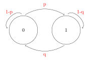

# Cadeias de Markov

Diremos que um PE {X(t), t $\in$ T} satisfaz a propriedade markoviana
(PM) se:

$$P(X(t_{n+1}) \leq | X(t_1) = x_1,...,X(t_n)=x_n) = P(X(t_{n+1}) \leq
X_{n+1} | X(t_n) = x_n)$$

Isso significa que a probabilidade condicional não leva em consideração
o que ocorreu antes do instante $t_n$ para calcular a probabilidade no
instante $t_n + 1$_

## Caso particular

No caso particular em que as VA's X(t) são DISCRETAS a propriedade
markoviana (PM) fica:

$$P(\underbrace{X_{n+1}}_{\text{Variável aleátoria}} =
\underbrace{x_{n+1}}_{\text{número real}}| X_1 = x_1,...,X_n=x_n) =
P(X_{n+1} = X_{n+1}| X_n = x_n)$$

Nesse caso, o processo {$X_n$, n $\geq$ 1} é chamado de `cadeia de
markov`.

Algunas autores resumem essa propriedade dizendo que:

> O futuro do processo depende somente do presente e não do passado. (ou
> instante mais recente)

```{example}
No caso do experimento de jgoar uma moeda, seja $G_n$ o capital do
jogador no instante n:

{$G_n$ n $\geq$ 0} é um PE, discreto a tempo discreto.

S = {-20,-19,...,27,28} -> espaço de resultados possíveis

T = {0,1,2,...,24}
```
\
```{definition}
Para uma cadeia de markov (CM) {$X_n$, n $\geq$ 0} a probabilidade
condicional P($X_{n+1} = y | X_n = x)$ será chamada de **probabilidade
de transfição** e denotada como P(x,y).
```
\
(Vamos sempre supor que essa probabilidade independe de m, ou seja, a CM
é homogenea)

```{example, name = "CADEIA DE MARKOV DE 2 ESTADOS"}
Suponha que uma máquina, em um dia qualquer, pode estar *quebrada* ou
*operando*. Assuma que se ela esta **quebrada** no inicio do n-eisimo
dia, a probabilidade ser *consertada* e estar operando no dia SEGUINTE é
`p`.

Por outro lado, se a máquina estiver **funcionando** no n-esimo dia, a
probabilidade dela *quebrar* e não estar funcionando no dia seguinte é
`q`.

Vamos assumir que as probabilidades condicionais para o n-esimo dia
depende apenas do estado do dia anterior.

Seja $\prod_0(0)$ a probabilidade da máquina estar quebrada no instante
inicial e $\prod(0)(1)$ a probabilidade de estar funcionando no instante
inicial.

Temos então que:

$$
X_n \left\{\begin{matrix}
0 &, \text{ se a maq. esta quebrada no dia n} \\
1 &, \text{ se a maq esta funcionando no dia n}
\end{matrix}\right.
$$

```{r,echo = FALSE, out.width='30%', fig.align = 'center'}

```


Ou seja,

$P(0,1) = P(X_{n+1}=1|X_n=0) =p$

$P(1,0) = P(X_{n+1}=0|X_n=1) =q$

$P(0,0) = P(X_{n+1} =0|X_n=0)=1-p$

$P(1,1) = P(X_{n+1}=1|X_n=1)=1-q$

## Distribuição do Processo

Antes de fazermos a distribuição do processo lembramos que:

```{theorem,name = "Probabilidade Total"}
$$X,Y = P(X=x) = \sum_y P(X=x,Y=y)$$
```

PROBABILIDADE CONDICIONAL

$$P(X=x,Y=y) = P(Y=y|X=x)P(X=x)$$


\begin{equation}
\begin{split}
P(X_{n+1}=0) &= P(X_{n+1}=0,X_{n}=0) + P(X_{n+1}=0,X_n=1) \\
&= P(X_{n+1}=0|X_n = 0)P(X_n=0) + P(X_{n+1}=0|X_n = 1)P(X_n=1)\\
&= (1-p)P(X_n=0) + qP(X_n=1) \text{  // observe que }P(X_n=1)=1 -
P(X_n=0)\\
&= (1-p)P(X_n=0)+ q(1-P(X_n=0))\\
&= (1-p-q)P(X_n=0) + q
\end{split}
\end{equation}


seja n = 0

\begin{equation}
\begin{split}
P(X_1=0) &= (1-p-q)\overbrace{P(X_0=0)}^{\prod_0(0)} + q\\
&=(1-p-q)\prod_0(0) + q
\end{split}
\end{equation}

Seja n = 1

\begin{equation}
\begin{split}
P(X_2=0)&=(1-p-q)P(X_1=0) + q \text{ // utilizando o resultado
anterior}\\
&= (1-p-q)[(1-p-q)\prod_0(0) + q] + q\\
&= (1-p-q)^2 \prod_0(0) + (1-p-q)q + q\\
&= (1-p-q)^2\prod_0(0) + q(1-p-q + 1)
\end{split}
\end{equation}

Seja n = 2

\begin{equation}
\begin{split}
P(X_3=0)&=(1-p-q)P(X_2=0) + q \text{ // utilizando o resultado
anterior}\\
&= (1-p-q)[(1-p-q)^2\prod_0(0) + (1-p-q)q + q] + q\\
&= (1-p-q)^3 \prod_0(0) + (1-p-q)q + (1-p-q)^2q + q\\
&= (1-p-q)^3 \prod_0(0) + q(1 + (1-p-q) + (1-p-q)^2)
\end{split}
\end{equation}

Forma geral

$$P(X_n=0)=(1-p-q)^2\prod_0(0) + q \sum_{j=0}^{n-1}(1-p-q)^j$$

Vamos supor que p + q > 0 logo:

PROGRESSÃO GEOMETRICA

$$\sum_{j=0}^{n-1} r^j = \frac{1-r^m}{1-r}$$

No nosso caso:

$$\sum_{j=0}^{n-1} (1-p-q)^j = \frac{1-(1-p-q)^n}{p+q}$$

Finalmente

$$P(X_n=0)= \frac{q}{p+q} + (1-p-q)^n[\prod_0(0) - \frac{q}{p+q}]$$

$$P(X_n=1)= \frac{p}{p+q} + (1-p-q)^n[\prod_0(1) - \frac{p}{p+q}]$$

OBS:

Distribuição limite

$$\underset{n \to \infty}{lim} P(X_n=0) = \frac{q}{p+q}$$

$$\underset{n \to \infty}{lim} P(X_n=1) = \frac{p}{p+q}$$


## Forma matricial

Temos conhecido as probabilidades:

$$P(X_{n+1} = 1| X_n = 0) = P(0,1) = p$$

$$P(X_{n+1}|X_n=1) = P(1,0) = q$$

Podemos colocar essas probabilidades na forma de uma matriz.


\begin{equation}

P = \begin{bmatrix}
P(0,0) & P(0,1) \\
P(1,0) & P(1,1)
\end{bmatrix} =
\begin{bmatrix}
1-p & p \\
q & 1-q
\end{bmatrix}

\end{equation}


A matriz P será chamada de matriz de transição de **um passo**.


Carácteristicas da Matriz:

* Matriz quadrada

* Matriz estocástica
  + significa que a soma das linhas é igual a 1.


## Espaços de estados

Seja {$X_n$, n $\geq$ 0} uma CM com $\overbrace{\text{espaços de
estados}}^{\text{o 'passo'}}$ S definimos a função de transição a 1
passo como P(x,y)=P($X_{n+1}$=y|$X_n$=n).

Notar que P(x,y) é uma distribuição de probabilidade pois $P(x,y) \geq
0$ e $\underbrace{\sum_{y \in S} P(x,y) = 1}_{\text{soma das linhas}}, x
\in S$

A função $\prod_0(x)$, x $\in$ S, definido por $\prod_0(x)=P(X_0=x), x
\in S$ é chamada de **distribuição inicial** do CM.

Também, $\prod_0(x) \geq 0$ e $\sum_{x \in
S}\underbrace{\prod_0(x_i)}_{\text{instante inicial}}=1$.

Pode ser provado que a distribuição da cadeia em qualquer instante fica
completamente determinado pelo conhecimento das probabilidades de
transição e pela distribuição normal.

```{example}

\begin{equation}
\begin{split}

P(X_0=x_0,X_1=x_1) &= \overbrace{P(X_1=x_1 | X_0 = x_0)}^{P(x_0,x_1)} \overbrace{P(X_0=x_0)}^{\prod_0(x)}\\
&= P(x_0,x_1) \prod_0(x)
\end{split}
\end{equation}

Da mesma forma $P(X_0=x_0,X_1=x_1,X_2=x_2)$

\begin{equation}
\begin{split}
P(\overbrace{X_0=x_0,X_1=x_1}^{A},\overbrace{X_2=x_2}^{B}) &= P(X_2 =
x_2 | X_0 = x_0, X_1 = x_1) P(X_1=x_1|X_0=x_0) P(X_0=x_0)\\
&= P(X_2 = x_2, X_1 = x_1) P(x_0,x_1)\prod_0(x_0) \text{\\ corta-se }
X_0 \text{ por que é uma CM}\\
&= \prod_0(x_0) P(x_0,x_1) P(x_1,x_2)
\end{split}
\end{equation}

# Fórmula geral

Em geral, a distribuição da cadeia vai ser:

$$P(X_0 = x_0, X_1 = x_1,...,X_n=x_n) = \prod_0(x_0) P(x_0,x_1)
P(x_1,x_2) ... P(x_{n-1},x_{n})$$
```

```{example,"Exemplo da máquina"}

No exemplo da máquina que queremos calcular a probabilidade da máquina
estar funcionando hoje e estar funcionando ainda depois de amanhã. Ou
seja, precisamos calcular:

\begin{equation}
\begin{split}
P(X_{n+2} = 1| X_n=1) &= P(1,0) \* P(0,1) + P(1,1) \* P(1,1)\\
&= qp + (1-q)(1-q)\\
&=pq + (1-q)^2
\end{split}
\end{equation}

As probabilidades de transição a n-passos podem ser facilmente obtidas
pela matriz $P^n$ sendo:

$$P^n = p*p*...*p$$

No exemplo:

\begin{equation}
P^2 = \begin{bmatrix}
1-p & p \\
q & 1-q
\end{bmatrix}

\begin{bmatrix}
1-p & p \\
q & 1-q
\end{bmatrix}
=

\begin{bmatrix}
(1-p)^2 +pq &  (1-p)p + (1-q)p \\
q(1-p) + q(1-q) & pq + (1-q)^2
\end{bmatrix}
\end{equation}


Em resumo, a função de transição a n-passos $P^n(x,y)$ é definida por:

$$P^n(x,y)= \sum_{y_1} ... \sum_{y_{n-1}} P(x_1,y_1) P(y_1,y_2)
... P(y_{n-1},y_n)$$
```
\
\
```{proposition,"Fórmula de CHAPMAN-KOLMOGOROV"}
$$P^{n+m}(x,y) = \sum_z P^n(x,z) P^m(z,y)$$

Para uma CM com espaços de estados finitos a matriz $P^n$ será uma
matriz finita.

Notar que a:

\begin{equation}
\begin{split}
P(X_n=y) &= \sum_{x \in S} P(X_0=x,X_n=y)\\
&= \sum_{x \in S} \overbrace{P(X_n=y|X_0=x)}^{P^n}
\overbrace{P(X_0=x_0)}^{\prod_0(x)}\\
&= \sum_{x \in S} \prod_0(x) P^n(x,y).
\end{split}
\end{equation}


Matricialmente, $\prod_n=\prod_0P^n$

sendo que $\prod_n$ é a distribuição de $X_n$
```
